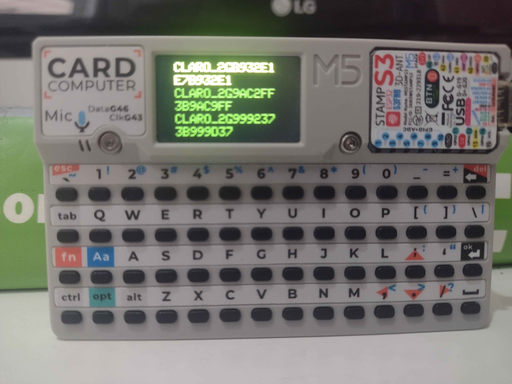
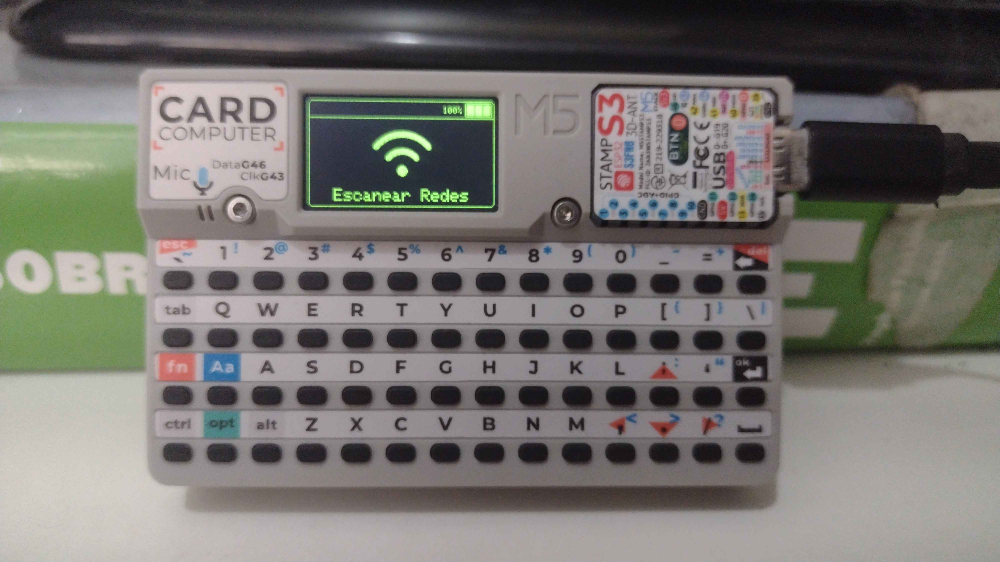
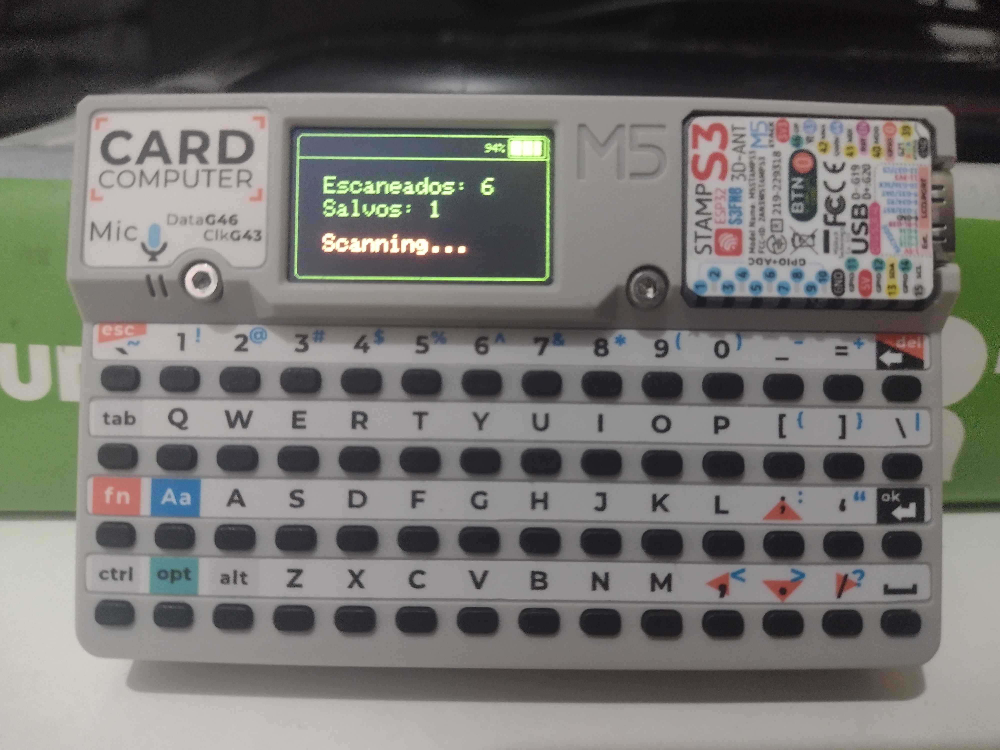
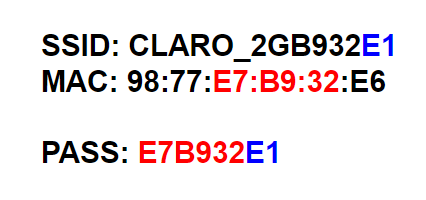

# Default Password WiFi Owner para cardputer

Este projeto utiliza um ESP32 (Cardputer) para escanear redes Wi-Fi próximas e verificar se há falhas de segurança em certos modelos de roteadores (Claro e NET). É inspirado pelo projeto: [DPWO](https://github.com/caioluders/DPWO).






## Introdução

Este projeto foi desenvolvido para identificar senhas padrão de certos modelos de roteadores. Ele usa um ESP32 para escanear redes próximas e tentar descobrir senhas baseadas em padrões conhecidos.

## Como funciona

1. **Identificação do SSID e endereço MAC:** O ESP32 escaneia as redes Wi-Fi próximas e coleta o SSID e o endereço MAC dos roteadores.

2. **Formatação da Senha:** O ESP32 concatena o SSID e o MAC para gerar possíveis senhas padrão para os roteadores.



3. **Teste de Conexão:** O ESP32 tenta se conectar à rede usando a senha gerada. Se a conexão for bem-sucedida, o SSID e a senha são armazenados no cartão microSD para referência futura.

## Instalação

### Pré-requisitos

- [VSCode](https://code.visualstudio.com/)
- [PlatformIO](https://platformio.org/)
- [Python 3](https://www.python.org/)
- [Esptool](https://docs.espressif.com/projects/esptool/en/latest/esp32/)

Você pode compilar o projeto localmente usando o arquivo `build.bat` incluído no repositório, ou pode baixar o binário mais recente das [releases](https://github.com/spoycrab/dpwo-cardputer/releases) e gravar localmente usando `esptool.py`.

```bat
esptool --port COM1 write_flash 0x00000 dpwo.bin
```
Substitua `COM1` pela porta serial correta do seu ESP32 e `dpwo.bin` pelo nome do arquivo binário gerado.

## Aviso Legal

**Conectar-se a redes Wi-Fi de terceiros sem permissão é ilegal e pode ter consequências legais graves.**

Este projeto é fornecido exclusivamente para fins educacionais e de teste em redes Wi-Fi para as quais você tem autorização explícita. O uso deste projeto para tentar acessar redes de terceiros sem permissão é uma violação das leis de privacidade e segurança, e pode ser considerado um crime.

Antes de utilizar este projeto, certifique-se de que você tem a permissão adequada para escanear e testar as redes Wi-Fi. Não me responsabilizo por qualquer uso inadequado ou ilegal deste software.

Se você deseja aprender sobre segurança de redes Wi-Fi, recomendo que o faça em ambientes controlados e com redes para as quais você tem plena autorização.

**No Brasil**, a Lei nº 12.737/2012, que altera o Código Penal, prevê punições para invasão de dispositivos eletrônicos sem autorização (Art. 154-A).
